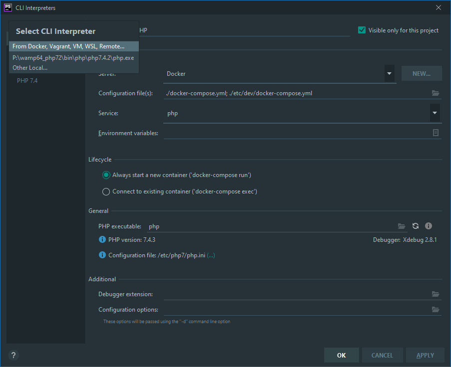
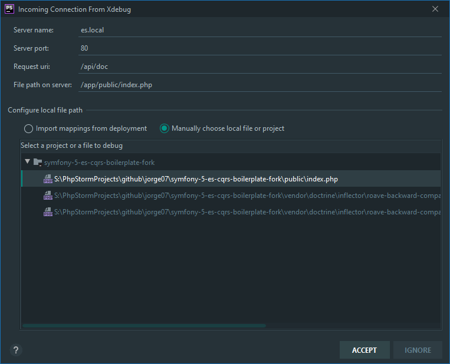

# Symfony 5 ES CQRS Boilerplate
<!-- ALL-CONTRIBUTORS-BADGE:START - Do not remove or modify this section -->

<!-- ALL-CONTRIBUTORS-BADGE:END -->

A boilerplate for DDD, CQRS, Event Sourcing applications using Symfony as framework and running with PHP 8.

> Symfony 4 still available in [symfony-4 branch](https://github.com/jorge07/symfony-5-es-cqrs-boilerplate/tree/symfony-4)

## Documentation

[Buses](https://github.com/jeanmarie110/Event-Sourcing-and-CQRS/tree/master/doc/GetStarted/Buses.md)

[Creating an Application Use Case](https://github.com/jeanmarie110/Event-Sourcing-and-CQRS/tree/master/doc/GetStarted/UseCases.md)

[Adding Projections](https://github.com/jeanmarie110/Event-Sourcing-and-CQRS/tree/master/doc/GetStarted/Projections.md)

[Async executions](https://github.com/jeanmarie110/Event-Sourcing-and-CQRS/tree/master/doc/GetStarted/Async.md)

[UI workflow](https://github.com/jeanmarie110/Event-Sourcing-and-CQRS/blob/master/doc/Workflow.md)

[Xdebug configuration](https://github.com/jeanmarie110/Event-Sourcing-and-CQRS/blob/master/doc/GetStarted/Xdebug.md)

[Kubernetes Deployment](https://github.com/jeanmarie110/Event-Sourcing-and-CQRS/blob/master/doc/Deployment.md)

## Architecture

## Implementations

- [x] Environment in Docker
- [x] Symfony Messenger
- [x] Event Store
- [x] Read Model
- [x] Async Event subscribers
- [x] Rest API
- [x] Web UI (A Terrible UX/UI)
- [x] Event Store Rest API 
- [x] Swagger API Doc

## Use Cases

#### User
- [x] Sign up
- [x] Change Email
- [x] Sign in
- [x] Logout

## Stack

- PHP 8+
- Mysql 8.0
- Elastic & Kibana 7.11.0
- RabbitMQ 3

## Project Setup

|    Action        	|     Command    |
|------------------	|---------------	|
|  Setup 	          | `make start`   |
|  Run Tests       	| `make phpunit` |
|  Static Analisys 	| `make style`  	|
|  Code Style      	| `make cs`     	|
|  Code style check	| `make cs-check`|
|  PHP Shell 	      | `make s=php sh`|
|  Xdebug 	         | `make xoff/xon`|
|  Build Artifacts   | `make artifact`|

## PHPStorm integration

PHPSTORM has native integration with Docker compose. That's nice but will stop your php container after run the test scenario. That's not nice when using fpm. A solution could be use another container just for that purpose but is way slower and I don't want. For that reason I use ssh connection.

### IMPORTANT

> **ssh in the container it's ONLY for that reason and ONLY in the DEV TAG, if you've ssh installed in your production container, you're doing it wrong...***

[Click here for the detailed instructions about how to setup the PHP remote interpreter in PHPStorm.](https://github.com/jorge07/alpine-php/blob/master/doc/IDE.md)

If you're already familiar with it, here a quick configuration reference:

|    Host          	|    Direction  |
|------------------	|--------------	|
|  Docker 4 mac 	   | `localhost`   |
|  Dinghy       	   | `$ dinghy ip` |

**Port:** `2323`

**Filesystem mapping:** `{PROJECT_PATH}` -> `/app`

### Xdebug

To ease your development process, you can use Xdebug with PHPSTORM.

1. Add a Docker interpreter

   

2. Enable Xdebug listenning. Don't forget to also activate Xdebug helper from your browser.
   
   
   
   Additionally, you can check `Break at first line in PHP scripts` to ensure your debug is working.

3. Make a request from you API at http://127.0.0.1/api/doc for example. You should see this popup:

   
   
   Click on `Accept` and you should be ready to debug ! Start placing breakpoints on your code and enjoy debugging !

> Note for Windows users:
>
> You might need to update `docker-os=` to `docker-os=windows` in [Makefile](makefile)
> or specify its value on command line like `$ make start docker-os=windows`.

## Contributors ✨

Thanks goes to these wonderful people ([emoji key](https://allcontributors.org/docs/en/emoji-key)):
